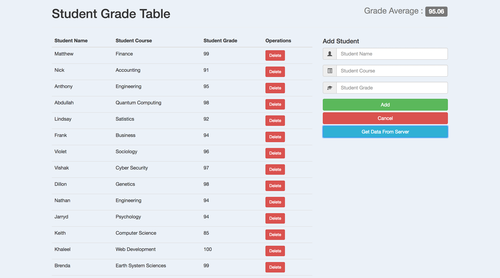
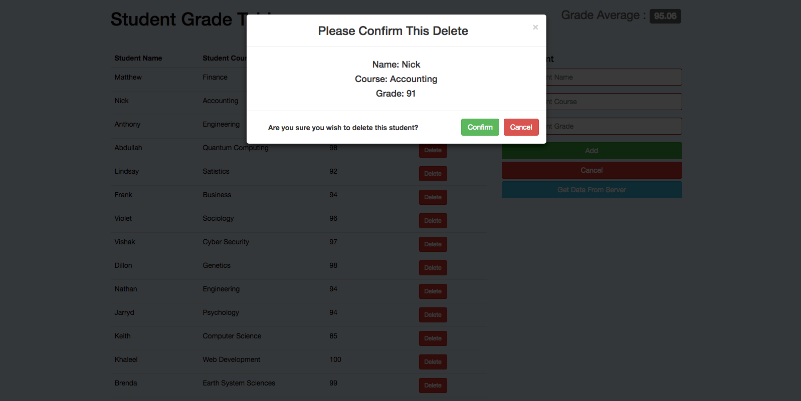
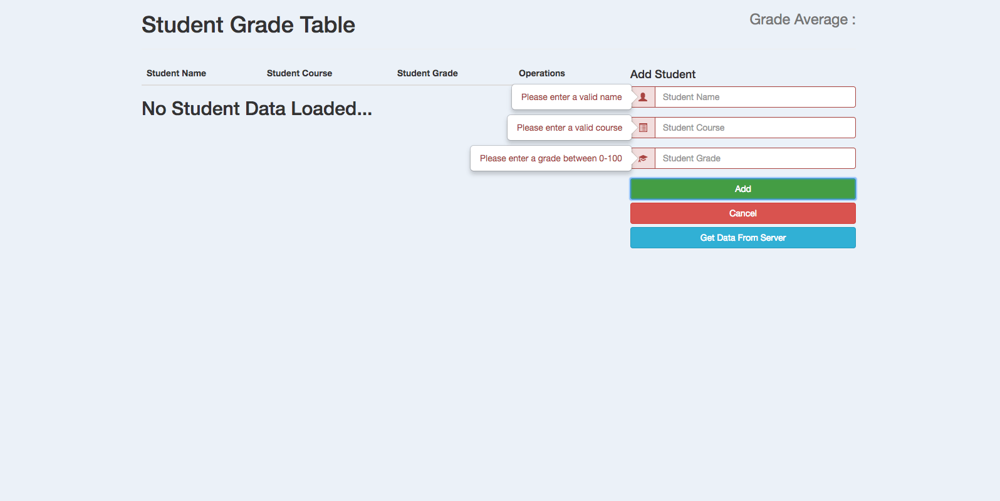

# Student Grade Table

- SGT is a Content Management System that utilizes CRUD operations on student Data using a MySql Database.
- Created the UI/UX with HTML5, CSS3, and Boostrap4 making it mobile-responsive.
- Implemented Javascript is used for the core functionality alongside jQuery for DOM manipulation and AJAX for communication with the PHP back-end.
- Deployed a PHP back-end that uses mysqli prepared statements to safely interface with the database.

:-------------------------:|:-------------------------:
 | 

## Technologies Used

* JavaScript
* jQuery
* AJAX
* HTML5
* CSS3
* Bootstrap3
* PHP
* MySQL

## Tools Used

* Git
* GitHub
* MeisterTask
* JSDoc

## Author

* Khaleel Younis [GitHub](https://github.com/stallenvp) | [Portfolio](https://khaleelyounis.com/)

